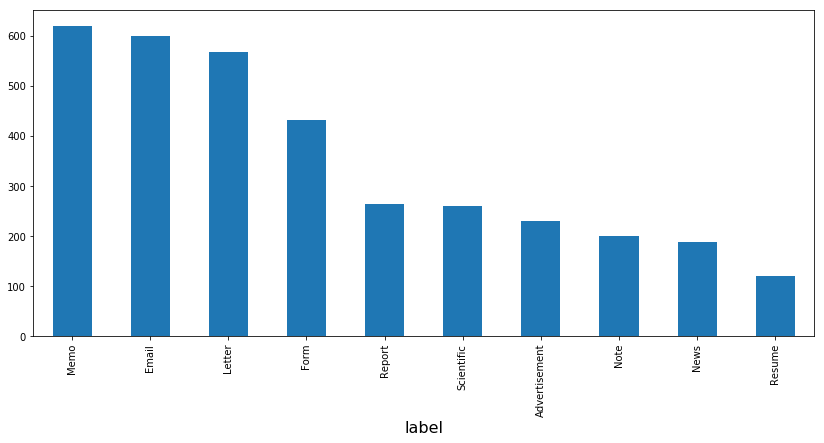
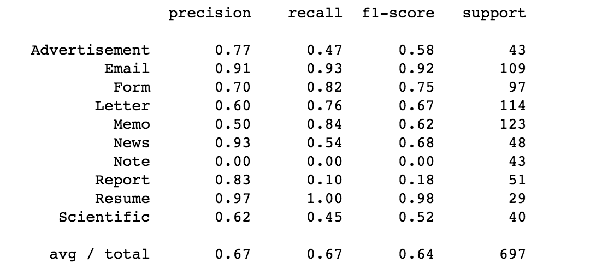
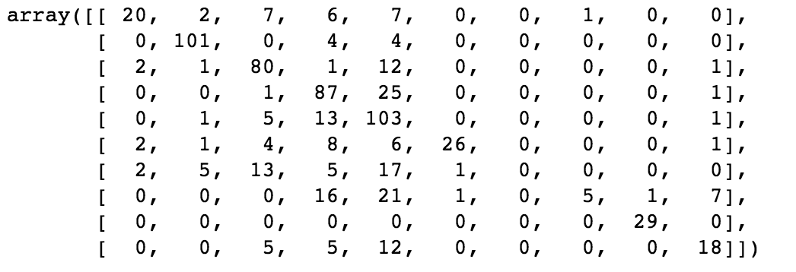
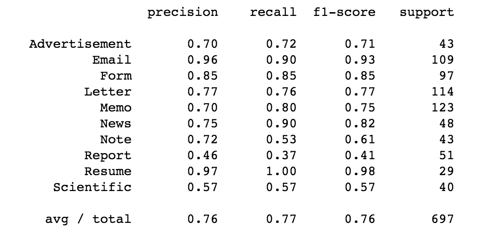
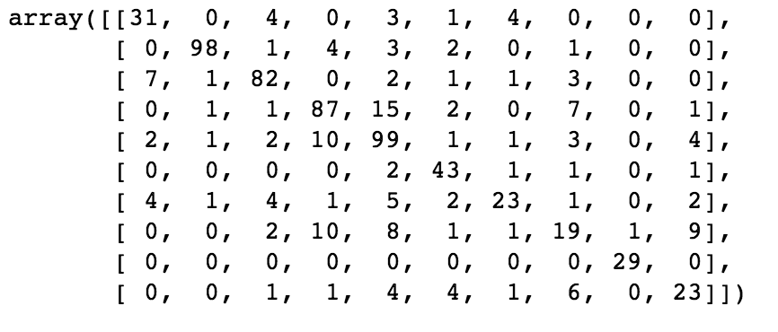

## Analyse 

Nos données:

  
On remarque qu'il y a 4 catégories qui se demarquent. En effet Email,memo,Letter et Form sont clairement plus représenté que les autres catégories puisque les 3 premières culminent à a peu près 600 suivis de Form qui culmine à 450, le reste des catégories est compris entre 150 pour la plus basse (resume) et 300 pour la plus haute (report). Neanmoins aucune cattégorie ne peut être marginalisée puisqu'il y a quand meme une bonne representation et un nombre assez raisonnable.

# Les  Solutions possibles  :

*  Naive bayse multinomial
* MLP

## Naive Bayes multinomial
On peut décider d'entrainer ce modèle en utilisant d'abord la methode de naive bayes multinomiale en utilisant notamment une représentation en bag of words utilisant Countvectorizer.

Après entrainement, les resultats sur les donnèes de test sont les suivants :

On peut remarquer que l'on a une précision qui est à peu près de 65% sur les différentes metrics, donc nos résultats ne sont pas très satisfaisant.

la matrice de confusion nous permet d'avoir plus de détail sur les différentes erreurs

## MLP

On va donc utiliser un MLP pour essayer d'augmenter nos résultats.

Nous pouvons remarquer un gain énorme en précision puisque l'on atteint les 76% pour les differentes metrics.

la matrice de confusion nous permet d'avoir plus de détail sur les différentes erreurs.

## Conclusion

En conclusion on peut dire que sur ce sujet différentes méthodes sont possibles, 
On peut remarquer néanmoins que le MLP assure de meilleurs résultats que le Naive Bayes, Néanmoins le temps d'exécution est plus élevé.

## Piste Amélioration 

On aurait pu utiliser gridSearch pour trouver les hyperparamètres et augmenté notre précision. Pour cela il aurait fallu separé les données en 3 compartiment, données de train,dev et test.
Une autre Amélioration aurait pu de faire une augmentation de données ce qui pourrait permettre une meilleure approche en deep learning
